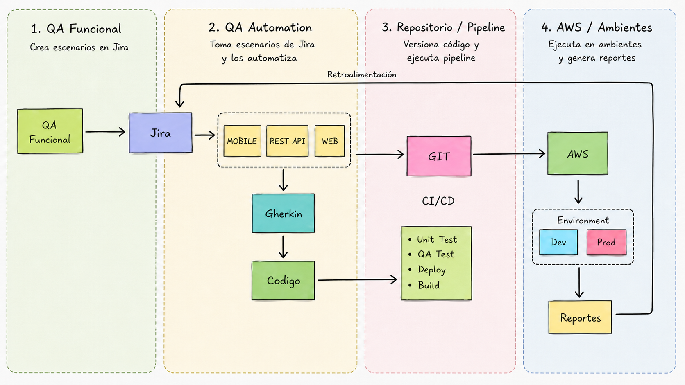

# Pipeline CI/CD

Este documento resume la propuesta de arquitectura para la automatización, el flujo de integración continua y entrega continua, los reportes y la forma de escalar la solución para un equipo de QA.

## Diagrama de Flujo

<p align="left">
	
</p>

### Pipeline Stages Detallados

**Stage 1: Build & Lint**
- Checkout código
- Install Node v22
- npm install
- npm run lint
- Validar TypeScript

**Stage 2: Unit Tests**
- npm run test:unit
- Generar coverage report
- Check: coverage ≥ 70%

**Stage 3: E2E & API Tests**
- Deploy a Staging
- npx playwright test tests/api
- npx playwright test tests/e2e
- Generar HTML reports

## Etapas del Pipeline

### 1. Build & Dependencies
```yaml
- Checkout código
- Instalar Node v22
- npm install
- Validar TypeScript
```

### 2. Unit Tests (Fast)
```yaml
- npm run test:unit
- Reporte de cobertura (mínimo 70%)
```

### 3. Deploy a Staging
```yaml
- Publicar aplicación en AWS
- Ejecutar smoke tests
```

### 4. E2E & API Tests
```yaml
- npx playwright test tests/api --project=api
- npx playwright test tests/e2e --project=e2e-chromium
- Generar reportes HTML
```

### Reportes Generados
- **HTML Report** (Playwright): screenshots, trazas, logs
- **Coverage Report**: líneas/branches testeadas
- **Jira Integration**: vinculación automática de tests con tickets
- **Dashboard en AWS CloudWatch**: métricas de ejecución
- **Trend Analysis**: histórico de éxito/fallo por suite
